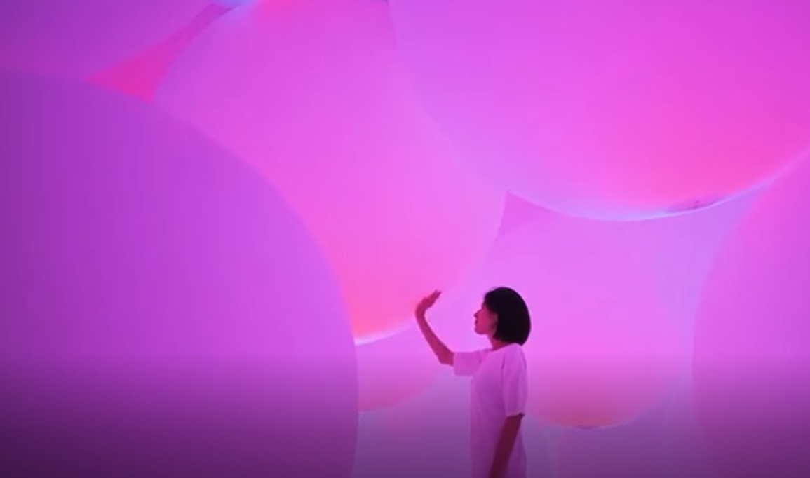
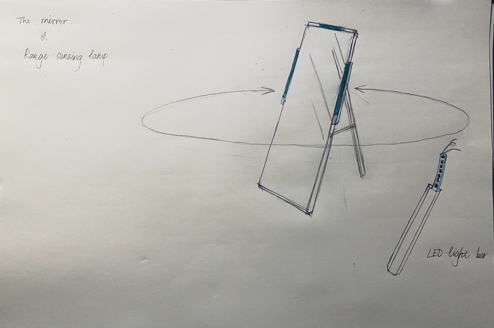
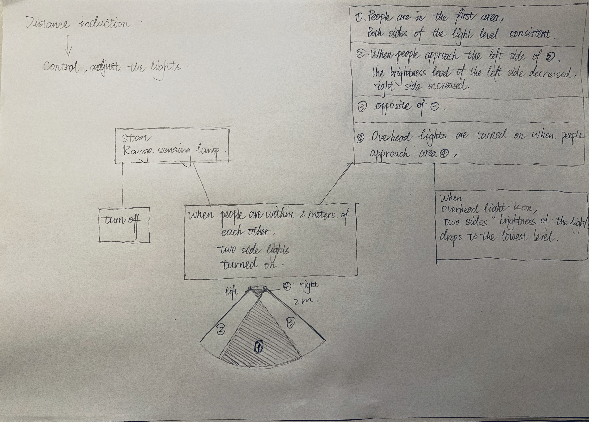
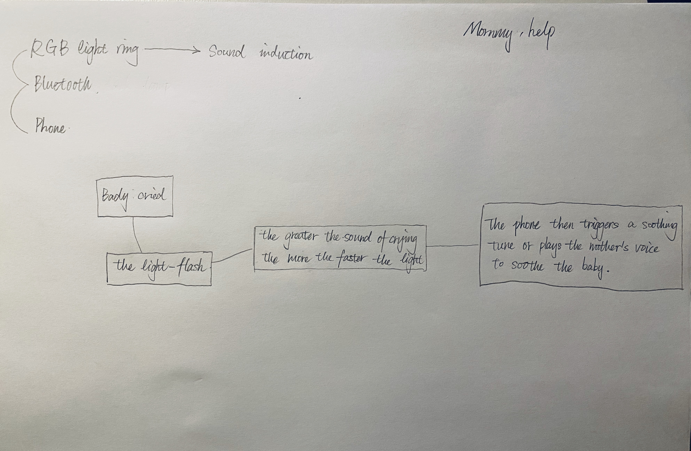
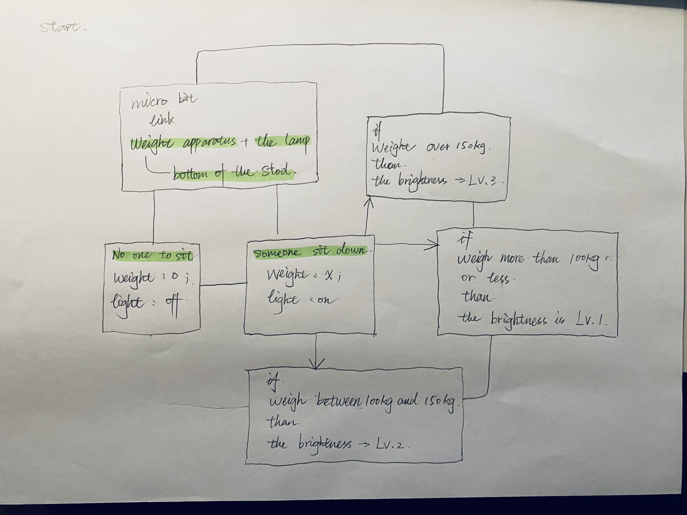
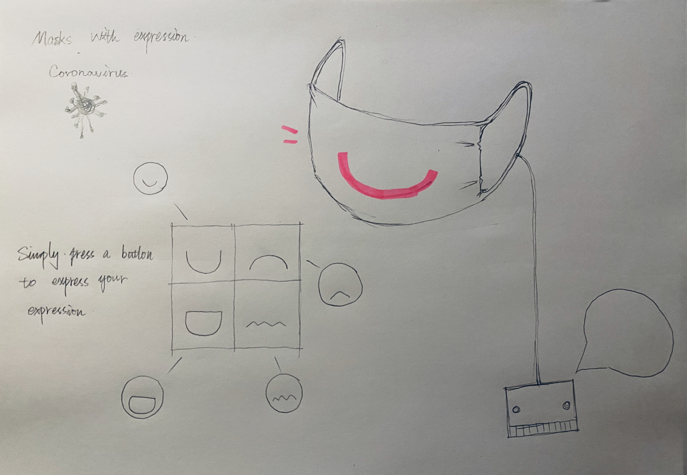
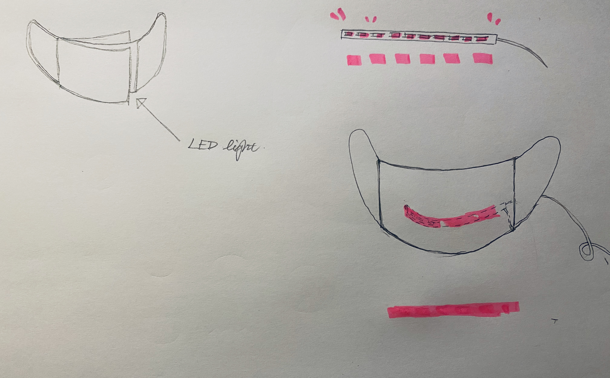

# Interactive lighting design

In the assessment 2 phase, I chose the lighting as the vehicle for the interaction design. I wanted to explore and absorb more of this type of interaction design.

This is an example of one of the studies. Teamlab light ball, Tokyo, Japan.

Screenshot of Teamlab light ball video

Video link: https://www.youtube.com/watch?v=NN1vbIbH3GE

## Interaction design between daily life and lighting ##
My personal starting point is to design a lighting interaction design that can bring convenience or pleasure to people's daily life.

In addition to Teamlab Light Ball, I have also studied several other works on lighting interaction design.

Video link:https://www.youtube.com/watch?v=R10_4ciWxgI

Catwalk panel is a touch sensitive led video panel which can bring a interactive element to any display, countertop, or wall.

Video link:https://www.youtube.com/watch?v=5zKCNq33YUM

Interactive Pixel Wall. It captures the movement of People's bodies through light sensing.

Video link:https://www.youtube.com/watch?v=5xUvqqSBWZM

Interactive table with LED lighting that react with the environment.

Video link:https://www.youtube.com/watch?v=w0OS3RpF3mE

Lights can be changed in color and shape by the presence of visitors.

Through the study and study of these lighting interaction design, let oneself have more design ideas and design ideas. Four original ideas for interactive design based on light sensing.

## Mirror Lamp ##

This is a light interaction design that helps people track and capture their orientation while looking in the mirror.

Design sketches

Design principle

Inspiration: people usually look in the mirror under a fixed light source. In order to cater to the light source, people often need to adjust their mirror when the position and angle. And this design is to let the light cater to us. You don't have to worry about the light finding you, even if you're looking in the mirror at close range.

## Mornmy hlep ##

This is an interactive design that uses a Bluetooth link to the phone and a light sensor. By sound sensing, the lights come on. And send a signal to the linked phone. People can control the lights remotely from their mobile phones.

Design Roadmap

I've seen this kind of interactive lighting design on wireless linked phones on the Internet, and many people still comment that the reception is not very stable, which may be due to the incompatibility of the APPS. So at the technical level I found it a bit difficult to finish the design.

## Gravity stool ##

The idea is that when people sit down, the stool will give them an interaction, and the change of light will bring a little fun to the space.

This design was actually my first design idea, and it's the one I've been thinking about the longest.
People usually sit on stools and are not fixed. Every once in a while, they adjust their posture to stay comfortable. During the adjustment, the weight of the stool will change. Light changes in color and brightness depending on gravity.

Design ideas

## Emoji mask ##

Under the influence of the coronavirus, people are forced to wear masks when they go out. While masks can protect our health, they can mask the expressions and smiles on our faces. The original idea for this portal was to give people under the influence of the epidemic a little more pleasure in communication.

Design Sketch

How to make it

I want to control the change of the light through the sound induction, complete the change of the light expression. That's what I want in this brief thought.

In the next Phase I will try to see if the methods are feasible. If that doesn't work, other methods will be changed to control the light expression.

## Next steps ##
The face mask emoji design was chosen as the final design among 4 design ideas. In the next phase, I'm going to try to make it out of different light materials, different masks. It will also try different ways to control the light expression, looking for the most suitable and convenient way for people to use it.

## Thank you for reading ##
